# Catalogue de données – Jumeau Numérique Urbain de Toulouse

## 📖 Présentation

Ce projet a été développé dans le cadre de mon stage de recherche à l'**IRIT (Institut de Recherche en Informatique de Toulouse)**.

Il s'agit d'une application web permettant d'explorer un catalogue de jeux de données Open Data, de les croiser géographiquement et de les visualiser directement sur une carte interactive.

L'objectif est de faciliter l'identification, l'exploration, le croisement et la visualisation des données mobilisables pour le développement d'un **jumeau numérique urbain** de la métropole toulousaine.

---

# ✨ Fonctionnalités

## 📂 Catalogue de données

Le catalogue permet de rechercher, filtrer et consulter les jeux de données grâce à plusieurs outils :

- 🔍 Recherche textuelle globale
- 🔤 Tri (alphabétique, taille, dernière modification)
- 🏷️ Filtres multicritères (mots-clés, géographie, temps, producteur, nature, format, exportation)
- 📄 Consultation des métadonnées détaillées (fiche descriptive)
- 🔗 Accès direct aux jeux de données
- 🗺️ Visualisation cartographique des jeux compatibles
- 🧭 Diagnostic spatial et jointure géographique automatique
- 🕓 Historique automatique des relevés de données (datasets dynamiques)

### Aperçu du catalogue

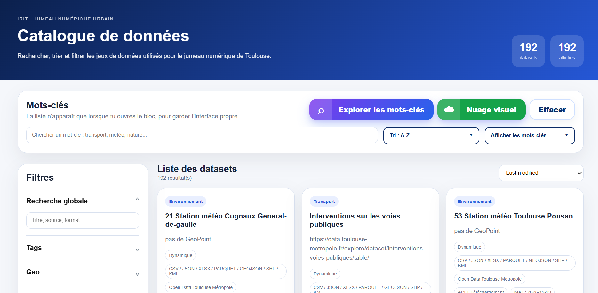

---

## 🔎 Recherche et filtres

Le catalogue propose plusieurs filtres afin de faciliter l'exploration des jeux de données.

### Recherche globale

Recherche simultanée dans le titre, la description, les formats et les métadonnées.

### Filtre géographique et thématique

Permet de sélectionner les jeux de données selon leur couverture géographique (commune, zone) et leurs mots-clés.

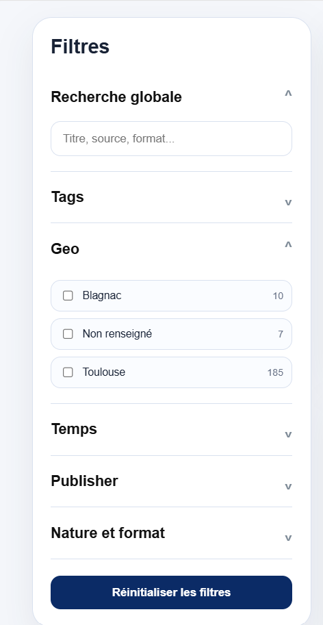

---

### Filtre des producteurs

Sélection des jeux de données selon leur organisme producteur (Open Data Toulouse Métropole, Data Gouv FR, INSEE, Cartes Gouv FR, Open Data Haute-Garonne, etc.).

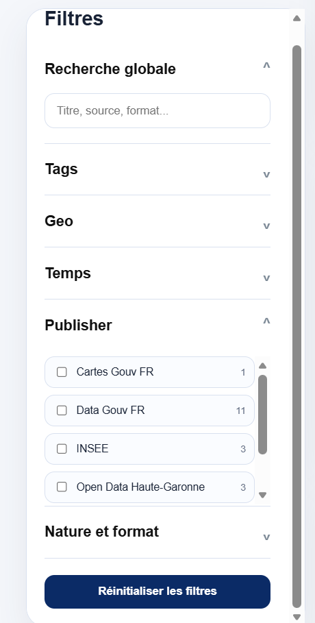

---

### Nature, formats et exportation

Les jeux de données peuvent également être filtrés selon :

- Nature (statique ou dynamique)
- Formats disponibles (CSV, JSON, GEOJSON, XLSX, PARQUET, SHP, KML...)
- Mode d'export (API, téléchargement...)

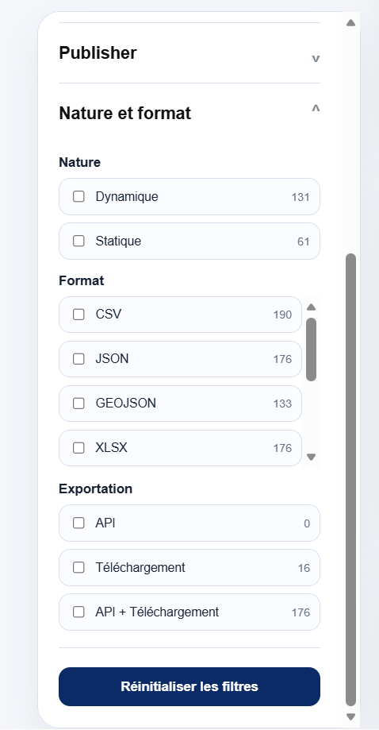

---

## 📄 Fiche descriptive d'un dataset

Chaque jeu de données dispose d'une fiche détaillée présentant :

- ses métadonnées générales (nature, formats, exportation, producteur, territoire, période couverte, type de géométrie) ;
- son usage prévu dans le jumeau numérique urbain ;
- ses mots-clés (tags) ;
- la liste de ses attributs, automatiquement classés par catégorie (localisation, temporel, identification, autres).

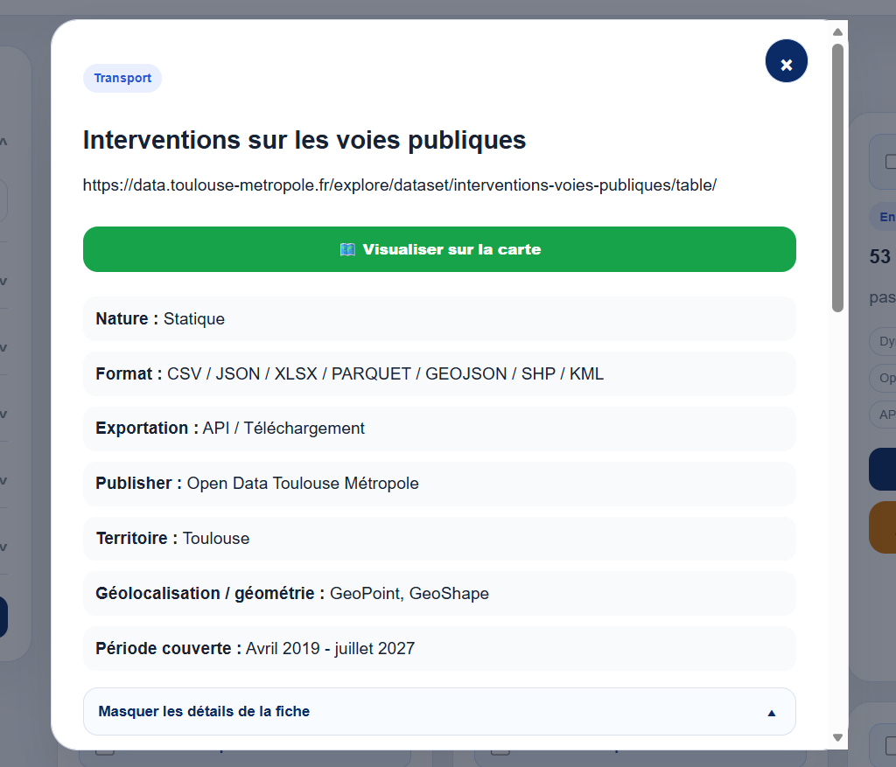

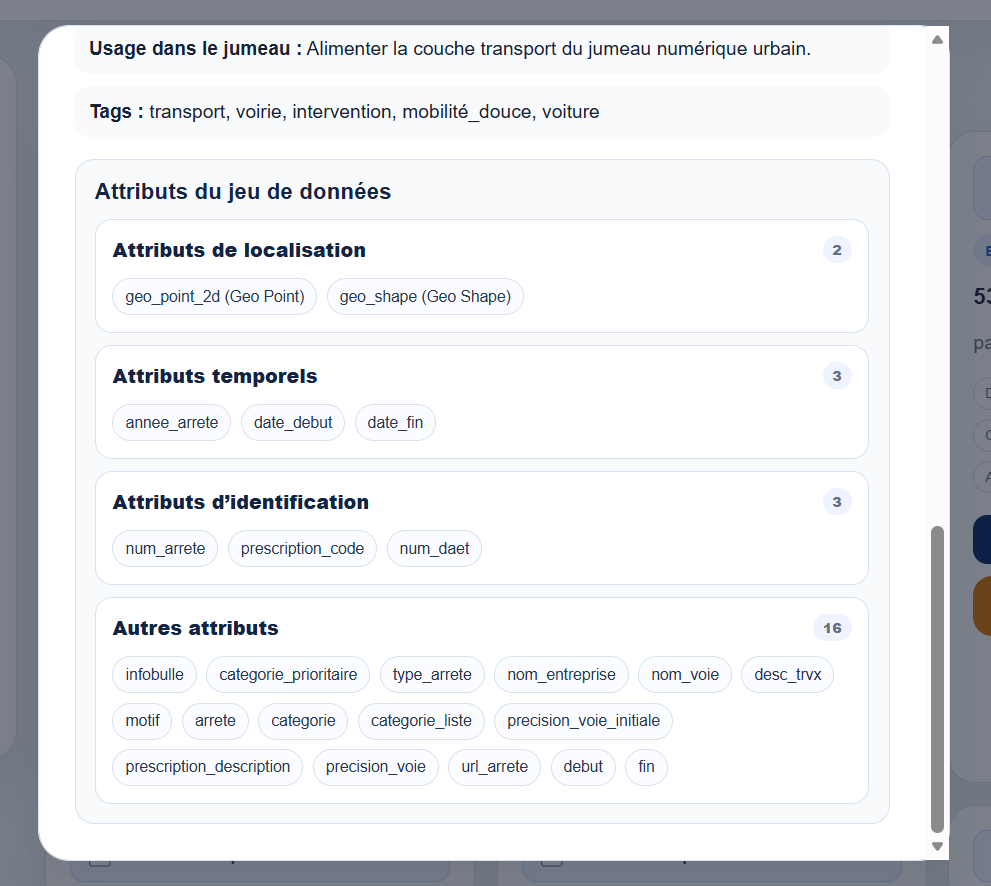

---

# ☁️ Exploration des mots-clés

Deux modes d'exploration complémentaires sont proposés.

## Vue par thématique

Les mots-clés sont organisés par thématique (Transport, Environnement, Population, etc.) afin de faciliter leur exploration.

Chaque mot affiche le nombre de datasets dans lesquels il apparaît.

Cette vue permet :

- une recherche de mots-clés ;
- un tri alphabétique, par fréquence ou par dernière modification ;
- une navigation par thématique.

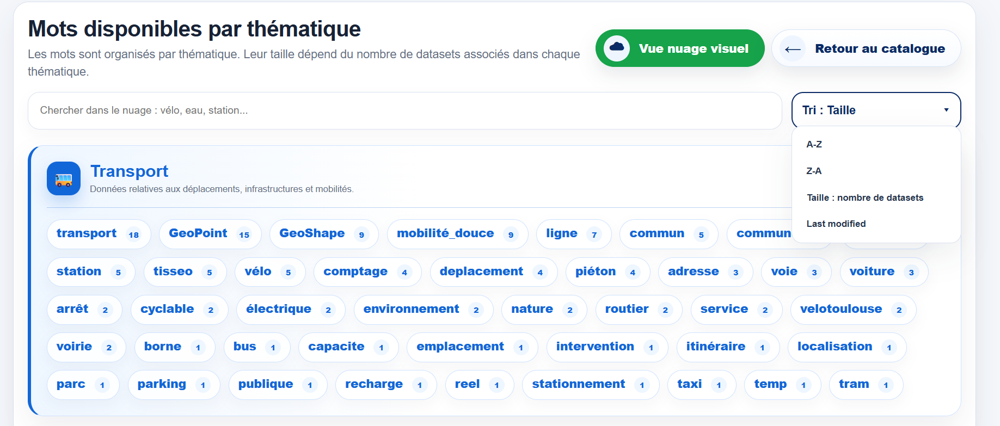

---

## Nuage de mots interactif

Les mots-clés sont affichés selon leur fréquence d'apparition, avec un code couleur (très fréquent, fréquent, moyen, moins fréquent).

Plus un mot apparaît dans les jeux de données, plus sa taille est importante.

Le nuage prend également en charge plusieurs **sous-ensembles de mots-clés**.

Exemples :

| Sous-ensemble | Composantes |
|---------------|-------------|
| Localisation | localisation, GeoPoint, GeoShape |
| Météo | météo, station_météo |
| Quartier | quartier, IRIS |
| Mobilité douce | mobilité_douce, vélo, VélÔToulouse |

Lorsqu'un sous-ensemble est sélectionné :

- toutes ses composantes sont automatiquement recherchées ;
- les jeux de données sont filtrés sans doublons ;
- le nombre d'occurrences affiché dans le nuage correspond à la somme des occurrences des composantes.

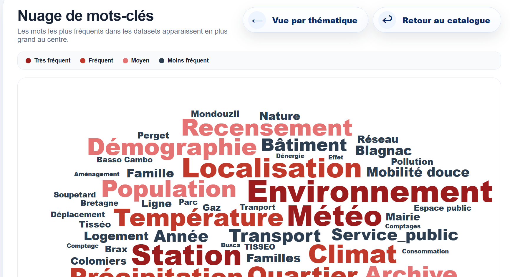

---

# 🗺️ Visualisation cartographique

Le projet intègre une visualisation cartographique interactive développée avec **Leaflet**.

Les jeux de données compatibles peuvent être affichés directement depuis le catalogue, qu'ils proviennent d'une API OpenDataSoft (paginée automatiquement), d'un fichier GeoJSON local ou d'un fichier GeoPackage (GPKG) multi-couches.

Les jeux actuellement pris en charge incluent notamment :

| Jeu de données | Source |
|----------------|--------|
| Comptages routiers et piétons | API Open Data Toulouse Métropole |
| Stations VélÔToulouse | API Open Data Toulouse Métropole |
| Interventions sur les voies publiques | API Open Data Toulouse Métropole |
| Lignes TISSEO | API Open Data Toulouse Métropole |
| Espaces verts / Zones de rencontre | GeoJSON local |
| Recensement de la population | CSV local (INSEE, filtré Toulouse Métropole) |
| Contours IRIS | GeoPackage local |
| BD TOPO (bâtiments, routes, réseaux...) | GeoPackage local multi-couches |

L'application détecte automatiquement le type de géométrie (Point, Polygon, MultiPolygon, GeoPoint, GeoShape) et convertit toutes les données au format GeoJSON pour un affichage homogène dans Leaflet.

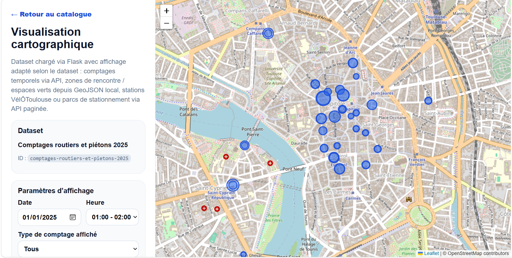

---

## Visualisation des données temporelles

Pour les jeux de données temporels, l'application adapte automatiquement les paramètres de visualisation.

L'utilisateur peut sélectionner :

- une date ;
- une heure ;
- le type de comptage (Tous, Piétons, Vélos, Voitures, Poids lourds).

Sans date, toutes les données s'affichent. Avec une date sans heure, toutes les lignes de la journée (ou dont la période l'inclut) sont retenues. Avec une heure précise, la donnée exacte est utilisée, ou la plus proche à défaut. Les jeux de données statiques masquent automatiquement ces paramètres.

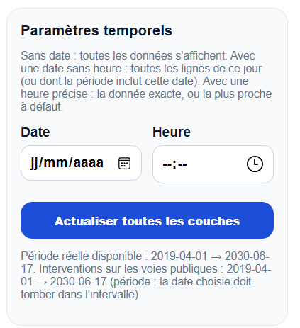

---

## Recherche de comptages

Le catalogue permet également de retrouver rapidement les jeux de données liés aux comptages (via les mots-clés) et de les ouvrir directement dans la carte interactive.

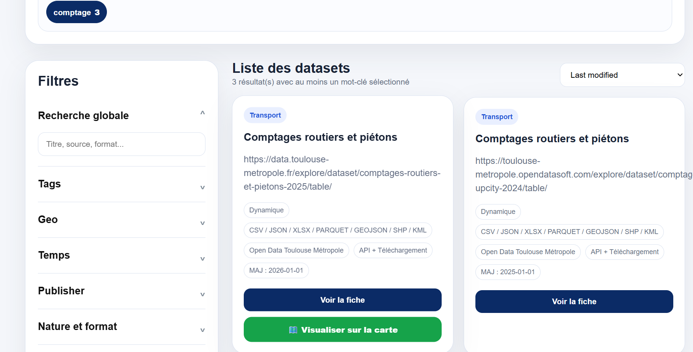

---

# 🧭 Diagnostic spatial et jointure géographique

Pour les jeux de données ne disposant d'aucune géométrie exploitable directement (ex. une station météo identifiée seulement par un libellé), l'application propose un **diagnostic spatial** : elle recherche dans le catalogue des référentiels géographiques compatibles en comparant les métadonnées et les valeurs réellement présentes dans les deux jeux de données.

Pour chaque référentiel candidat, un score de confiance est calculé à partir de la correspondance des clés (dataset analysé ↔ référentiel) et du taux d'unicité côté référentiel. L'utilisateur choisit ensuite manuellement le référentiel avec lequel croiser le dataset avant de visualiser le résultat sur la carte.

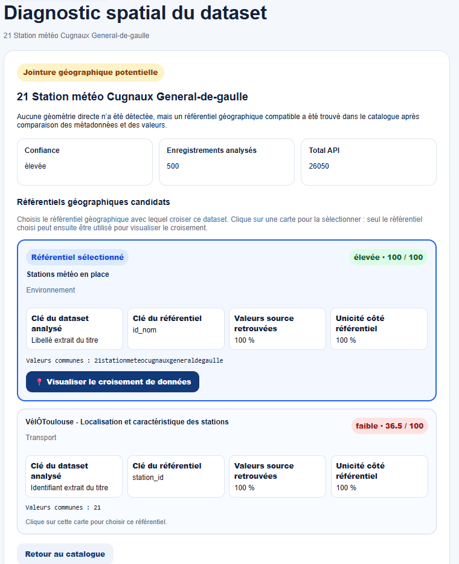

---

## Croisement cartographique multi-datasets

Plusieurs jeux de données sélectionnés (natifs ou obtenus après jointure) peuvent être chargés comme des couches indépendantes et superposés sur une même carte, chacun avec son propre style de marqueur et son propre choix d'attribut affiché dans le popup.

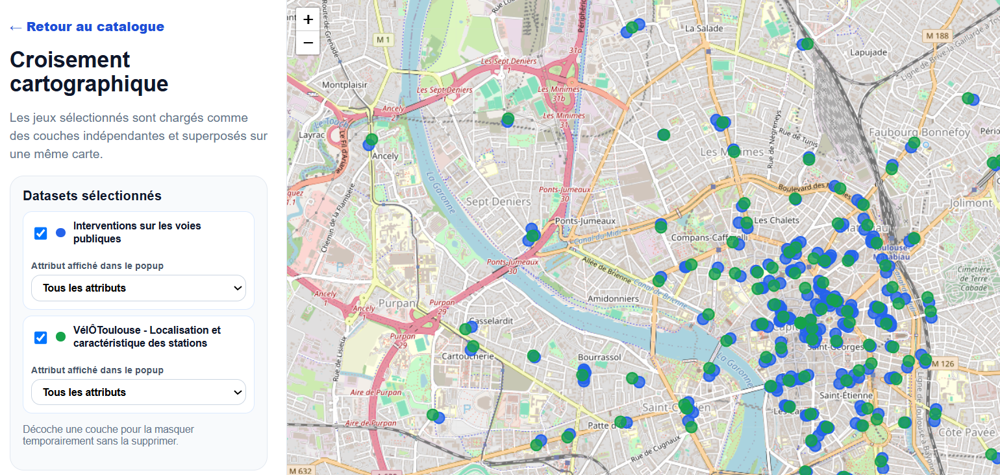

---

## Analyse spatiale intelligente, limitation de zone et export

La carte permet également de :

- limiter l'affichage à une commune, un quartier ou une adresse recherchée, avec application du filtre à toutes les couches chargées ;
- lancer une analyse spatiale intelligente entre deux jeux de données ou plusieurs couches d'un même fichier multi-couches (ex. BD TOPO) ;
- exporter les données telles qu'affichées sur la carte (après filtres de zone, date ou période), un fichier séparé étant généré par dataset chargé dans son format d'origine (CSV, GPKG, Shapefile, KML...).

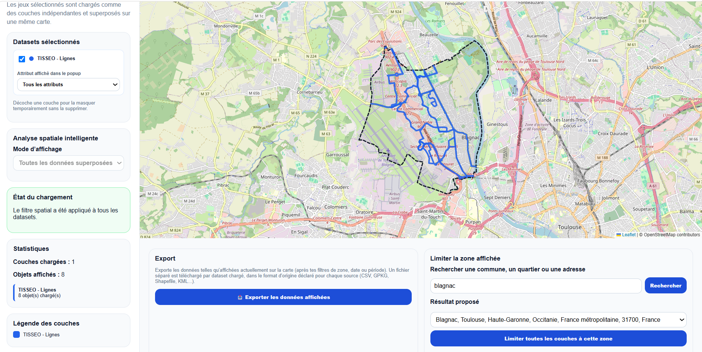

---

# 🕓 Historique automatique des données

Pour les jeux de données dynamiques (comptages, stations météo en temps réel...), l'application enregistre automatiquement des relevés successifs (snapshots) grâce à un planificateur de tâches (APScheduler), stockés dans une base SQLite locale (`history/history.db`).

Chaque relevé conserve l'identifiant et le titre du dataset, ainsi qu'un payload contenant les données brutes récupérées au moment du relevé (attributs, géométrie, métriques calculées), ce qui permet de constituer un historique exploitable pour l'analyse temporelle des jeux de données dynamiques.

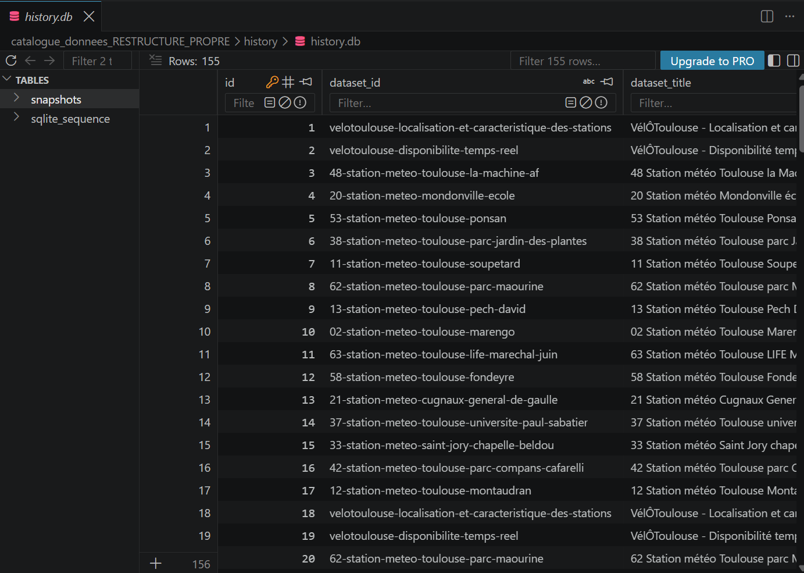

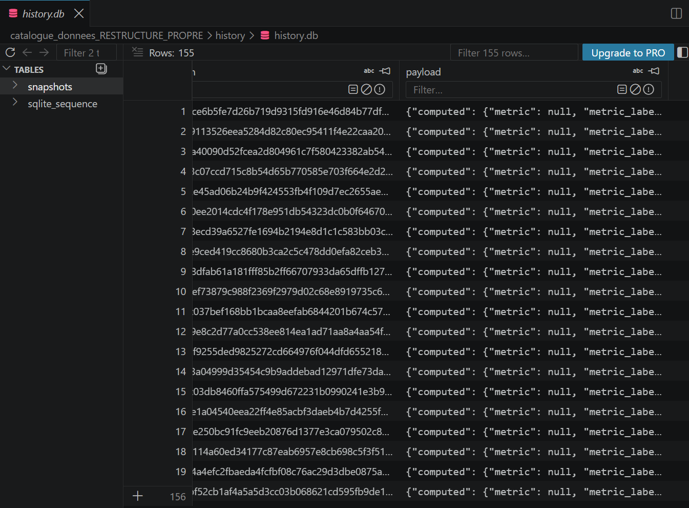

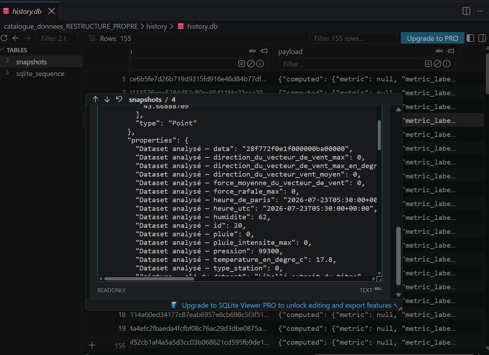

---

# ⚙️ Fonctionnement du serveur Flask

Le backend est développé avec **Flask** et organisé en modules par rôle :

- `app.py` : routes Flask et configuration générale ;
- `scripts/open_data_api.py` : couche de base sans dépendance interne — appels aux API Open Data (OpenDataSoft / data.gouv), gestion du schéma, du temporel et des géométries/enregistrements ;
- `scripts/catalog.py` : chargement et scoring des métadonnées du catalogue (fichier Excel) ;
- `scripts/local_sources.py` : gestion des sources locales (GPKG, GeoJSON, CSV), y compris BD TOPO, Contours IRIS et Recensement de la population ;
- `scripts/join_engine.py` : moteur de jointure géographique — recherche de candidats, diagnostic spatial, analyse spatiale intelligente.

Le serveur Flask assure notamment :

- la récupération des jeux de données ;
- l'appel aux API Open Data Toulouse Métropole et aux autres portails OpenDataSoft compatibles ;
- la gestion automatique de la pagination (récupération de l'ensemble des enregistrements disponibles, sans limitation aux 100 premiers résultats) ;
- la conversion GeoShape → GeoJSON et la détection automatique des géométries ;
- le filtrage géographique et l'échantillonnage des fichiers locaux volumineux (GeoPackage) directement au niveau du fichier, pour des temps de réponse raisonnables ;
- la génération des métadonnées, y compris la liste des couches disponibles pour les fichiers multi-couches ;
- la jointure géographique entre sources (API distantes et/ou fichiers locaux) ;
- l'enregistrement automatique de l'historique des jeux de données dynamiques ;
- l'adaptation automatique de la carte selon le ou les datasets sélectionnés.

---

# 📄 Connexion au catalogue Google Sheets

Le catalogue récupère automatiquement les métadonnées des jeux de données à partir d'un **Google Sheet**, via un **Google Apps Script**.

Le projet est **déjà configuré** et connecté au Google Sheet utilisé pour le développement du catalogue.

Le fichier du catalogue est fourni dans le dépôt, dans le dossier :

```text
data/
```

Il correspond au fichier :

```text
metadonnees_datasets.xlsx
```

Le script Google Apps Script permettant de publier les données est disponible dans :

```text
docs/google_sheet_apps_script.gs
```

---

## Utiliser votre propre Google Sheet

Si vous souhaitez connecter l'application à votre propre catalogue :

### 1. Remplacez le fichier du catalogue

Dans le dossier :

```text
data/
```

par votre propre fichier Google Sheets (ou un export Excel équivalent).

---

### 2. Ouvrez le script Google Apps Script

```text
docs/google_sheet_apps_script.gs
```

---

### 3. Remplacez l'identifiant du Google Sheet

```javascript
const DEFAULT_SPREADSHEET_ID = "...";
```

par l'identifiant de votre propre Google Sheet.

---

### 4. Déployez une nouvelle version du Google Apps Script

Une fois le nouvel identifiant renseigné, publiez une nouvelle version du Web App Google Apps Script.

---

### 5. Mettez à jour l'URL du Web App

Si nécessaire, modifiez dans l'application l'URL du Web App afin qu'elle pointe vers votre nouveau déploiement.

Le catalogue utilisera alors automatiquement les métadonnées de votre propre Google Sheet.

---

# 🛠 Technologies utilisées

## Backend

- Python
- Flask
- Requests
- GeoPandas / Fiona / Shapely
- APScheduler
- SQLite

## Frontend

- HTML5
- CSS3
- JavaScript

## Cartographie

- Leaflet
- OpenStreetMap

## Sources de données

- API Open Data Toulouse Métropole (et autres portails OpenDataSoft)
- Google Sheets
- GeoJSON
- GeoPackage (GPKG)
- CSV (INSEE)

---

# 📁 Structure du projet

Le projet est organisé selon l'architecture standard d'une application **Flask**, en séparant le backend (découpé en modules), les données, l'historique, les ressources statiques et les interfaces utilisateur.

```text
.
├── app.py
├── README.md
├── requirements.txt
│
├── scripts/
│   ├── __init__.py
│   ├── open_data_api.py
│   ├── catalog.py
│   ├── local_sources.py
│   ├── join_engine.py
│   └── filter_recensement_population.py
│
├── data/
│   ├── espaces-verts.geojson
│   ├── zones-de-rencontre.geojson
│   ├── metadonnees_datasets.xlsx
│   ├── iris.gpkg
│   ├── BDT_3-5_GPKG_LAMB93_D031-ED2025-12-15.gpkg
│   ├── recensement_2020_toulouse_metropole.csv
│   ├── recensement_2021_toulouse_metropole.csv
│   ├── recensement_2022_toulouse_metropole.csv
│   └── cache/
│
├── history/
│   └── history.db
│
├── docs/
│   ├── google_sheet_apps_script.gs
│   └── index_static_backup.html
│
├── images/
│   ├── index.png
│   ├── explorer_mots_cles.png
│   ├── nuage_de_mots.png
│   ├── recherche_comptage.png
│   ├── visualisation_comptage.png
│   ├── parametre_visualisation_temps.png
│   ├── diagnostic_spatial.png
│   ├── visualisation_croisement.png
│   ├── visualisation_limite_zone.png
│   ├── fiche_descriptive_1.png
│   ├── fiche_descriptive_2.png
│   ├── filtres_geo.png
│   ├── filtres_publisher.png
│   ├── filtres_nature_format_exp.png
│   ├── history_db_1.png
│   ├── history_db_2.png
│   └── history_db_3.png
│
├── static/
│   ├── css/
│   │   ├── style.css
│   │   └── carte_api.css
│   │
│   └── js/
│       ├── script.js
│       ├── script_extract.js
│       ├── sample-data.js
│       ├── wordcloud.js
│       └── carte_multi.js
│
└── templates/
    ├── index.html
    ├── wordcloud.html
    ├── wordcloud_visual.html
    ├── carte.html
    └── diagnostic_spatial.html
```

## Description des fichiers

### `app.py`

Point d'entrée de l'application Flask. Contient désormais uniquement les routes Flask et la configuration générale, la logique métier ayant été répartie dans le dossier `scripts/`.

---

### `requirements.txt`

Liste des bibliothèques Python nécessaires au fonctionnement du projet.

---

## Dossier `scripts/`

Contient l'ensemble de la logique métier du backend, découpée par rôle.

| Fichier | Description |
|---------|-------------|
| **open_data_api.py** | Couche de base sans dépendance interne : appels aux API Open Data (OpenDataSoft, data.gouv), gestion du schéma, du temporel et des géométries. |
| **catalog.py** | Chargement et scoring des métadonnées du catalogue (fichier Excel). |
| **local_sources.py** | Gestion des sources locales : fichiers GPKG, GeoJSON, CSV, dont BD TOPO, Contours IRIS et Recensement de la population. |
| **join_engine.py** | Moteur de jointure géographique : recherche de candidats, diagnostic spatial, analyse spatiale intelligente. |
| **filter_recensement_population.py** | Filtre les fichiers CSV bruts du Recensement de la population sur les communes de Toulouse Métropole. |

---

## Dossier `data/`

Contient les données utilisées par l'application.

| Fichier | Description |
|---------|-------------|
| **espaces-verts.geojson** | Jeu de données des espaces verts utilisé pour la visualisation cartographique. |
| **zones-de-rencontre.geojson** | Jeu de données des zones de rencontre affiché sur la carte interactive. |
| **metadonnees_datasets.xlsx** | Catalogue des métadonnées utilisé par l'application. Il contient les informations descriptives des datasets (titre, formats, mots-clés, producteurs, etc.). |
| **iris.gpkg** | Contours IRIS (France entière), filtrés et mis en cache sur Toulouse Métropole à l'usage. |
| **BDT_3-5_GPKG_LAMB93_D031-ED2025-12-15.gpkg** | BD TOPO, fichier GeoPackage multi-couches (bâtiments, routes, réseaux...). |
| **recensement_AAAA_toulouse_metropole.csv** | Recensement de la population (2020/2021/2022), filtré sur Toulouse Métropole, clé de jointure IRIS. |
| **cache/** | Cache disque des extractions de fichiers locaux volumineux, invalidé automatiquement si le fichier source est modifié. |

---

## Dossier `history/`

Contient l'historique automatique des relevés des jeux de données dynamiques.

| Fichier | Description |
|---------|-------------|
| **history.db** | Base SQLite (table `snapshots`) enregistrant, pour chaque relevé automatique, l'identifiant et le titre du dataset ainsi que le payload des données récupérées. |

---

## Dossier `docs/`

Contient les fichiers techniques liés au fonctionnement du catalogue.

| Fichier | Description |
|---------|-------------|
| **google_sheet_apps_script.gs** | Script Google Apps Script permettant de publier les métadonnées du catalogue depuis Google Sheets. |
| **index_static_backup.html** | Ancienne version statique du catalogue, conservée comme sauvegarde avant la migration vers Flask. |

---

## Dossier `images/`

Contient les captures d'écran utilisées dans le README GitHub afin d'illustrer les différentes fonctionnalités de l'application : catalogue principal, filtres, fiche descriptive, exploration des mots-clés, visualisation cartographique, diagnostic spatial, croisement cartographique et historique des données.

---

## Dossier `static/css/`

Contient les feuilles de style de l'application.

| Fichier | Description |
|---------|-------------|
| **style.css** | Feuille de style principale utilisée par le catalogue, les filtres, les mots-clés et les différentes pages HTML. |
| **carte_api.css** | Feuille de style spécifique à la visualisation cartographique et aux contrôles affichés sur la carte. |

---

## Dossier `static/js/`

Contient les scripts JavaScript assurant les fonctionnalités de l'application.

| Fichier | Description |
|---------|-------------|
| **script.js** | Script principal du catalogue : recherche, filtres, affichage des datasets et interactions générales. |
| **script_extract.js** | Extraction, regroupement et gestion des mots-clés, y compris les sous-ensembles (Localisation, Météo, Quartier, Mobilité douce). |
| **sample-data.js** | Chargement et préparation des métadonnées provenant du Google Sheet. |
| **wordcloud.js** | Génération de la vue thématique et du nuage de mots interactif. |
| **carte_multi.js** | Gestion de la carte Leaflet multi-couches, du diagnostic spatial, du croisement de jeux de données et de l'export. |

---

## Dossier `templates/`

Contient les pages HTML rendues dynamiquement par Flask.

| Fichier | Description |
|---------|-------------|
| **index.html** | Page principale du catalogue de données avec les filtres, la recherche et la liste des datasets. |
| **wordcloud.html** | Vue organisée des mots-clés par thématique. |
| **wordcloud_visual.html** | Nuage de mots interactif représentant la fréquence des mots-clés. |
| **carte.html** | Interface de visualisation cartographique permettant d'afficher et de croiser les jeux de données compatibles sur une carte Leaflet. |
| **diagnostic_spatial.html** | Interface de diagnostic spatial permettant de choisir un référentiel géographique de jointure pour un dataset sans géométrie directe. |

---

# 🚀 Installation

Cloner le dépôt

```bash
git clone https://github.com/douae-heddaji/urban-digital-twin-data-catalog.git
```

Installer les dépendances

```bash
pip install -r requirements.txt
```

Lancer l'application

```bash
python app.py
```

Puis ouvrir :

```
http://127.0.0.1:5000
```

---

# 🚧 Perspectives d'évolution

Les principales évolutions envisagées sont :

- ajout de nouveaux jeux de données ;
- intégration de données temps réel supplémentaires ;
- création de tableaux de bord interactifs ;
- calcul d'indicateurs statistiques à partir des historiques collectés ;
- aide à l'exploration des données grâce à l'intelligence artificielle.

---

# 👩‍💻 Auteure

**Douae Heddaji**

Stage de recherche

IRIT – Institut de Recherche en Informatique de Toulouse

Université Toulouse Capitole
